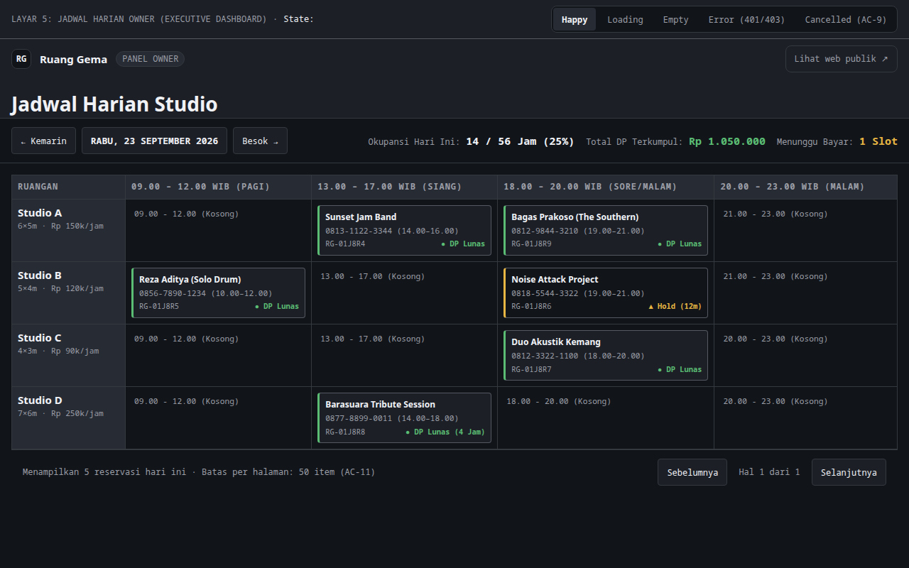

# 🎸 Ruang Gema — Music Rehearsal Studio Booking Platform

> **Sistem Reservasi & Manajemen Studio Musik Berbasis Jam** untuk band dan musisi, lengkap dengan timeline interaktif ketersediaan ruangan realtime dan integrasi pembayaran.  
> Arsitektur decoupled: **Laravel 12 Backend API + React (TypeScript/Vite) Frontend + TailwindCSS**.


<p align="center">
  
</p>

---

## 🚀 Fitur Utama

- ⏱️ **Visual Timecode Grid Timeline:**
  - Jadwal ruangan per jam ditampilkan dalam format timeline tabular monospace (VU-meter / timecode inspired).
  - Pengecekan ketersediaan 4 studio musik secara real-time tanpa delay.
- 📱 **Mobile-First Seamless Booking:**
  - Alur pemesanan cepat untuk musisi di HP dalam 3 langkah tanpa perlu login berbelit.
  - Validasi durasi sewa, perlengkapan tambahan (ampli, cymbal set, keyboard), dan kalkulasi harga instan.
- 📊 **Panel Manajemen Pemilik Studio:**
  - Kalender operasional studio, rekap reservasi harian, dan kontrol status slot ruangan.
- 🧪 **Full SOP Verification & E2E Testing:**
  - Dilengkapi dokumentasi lengkap, automated backend test suite, dan Playwright E2E journey.

---

## 🏛️ Struktur Repositori

```text
ruang-gema/
├── backend/          # Laravel 12 REST API & Database Migrations
├── frontend/         # React 19 + TypeScript + Vite + Tailwind UI
├── docs/             # Dokumentasi Arsitektur, User Guide & Runbook
│   ├── USER-GUIDE.md # Panduan pengguna
│   ├── RUNBOOK.md    # Developer setup & deployment guide
│   └── HANDOFF.md    # Spesifikasi teknis & acceptance criteria
└── DESIGN.md         # Kontrak desain visual & token anti-slop
```

---

## 🏁 Panduan Menjalankan

### Backend (Laravel API)
```bash
cd backend
composer install
cp .env.example .env
php artisan key:generate
php artisan migrate --seed
php artisan serve
```

### Frontend (React/Vite)
```bash
cd frontend
npm install
npm run dev
```

---

## 📜 Lisensi
MIT License © 2026 Samid & Ruang Gema Contributors.