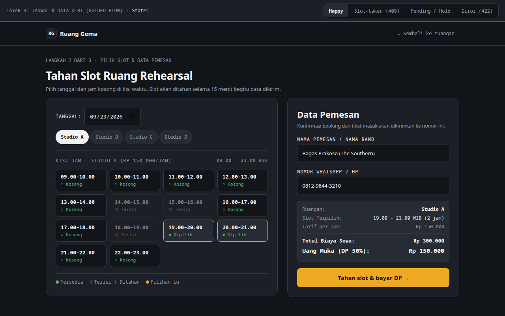

# 🎸 Ruang Gema — Music Rehearsal Studio Reservation System

> **Visual room × hour timecode reservation platform for professional music rehearsal studios with equipment rental add-ons and owner capacity management.**

---

## 📸 Visual Showcase & Reservation Flow

<p align="center">
  
</p>
<p align="center"><em>Figure 1: Room × Hour reservation matrix showing real-time booked, locked, and available practice slots.</em></p>

<br />

<div align="center">
  <table width="100%">
    <tr>
      <td width="50%" align="center">
        
        <br /><strong>Figure 2: Studio Admin Capacity Timeline</strong><br />
        <em>Daily studio occupancy rate, financial takings, and double-booking conflict prevention radar.</em>
      </td>
      <td width="50%" align="center">
        
        <br /><strong>Figure 3: Musician Booking & Equipment Add-ons</strong><br />
        <em>Customizable booking form with Marshall/Ampeg amp selection, double-pedal rentals, and instant checkout.</em>
      </td>
    </tr>
  </table>
</div>

---

## ⚡ Concurrency & Slot Locking Architecture

- **Pessimistic Slot Locks:** During checkout, chosen rehearsal slots are locked in Redis for 10 minutes to prevent double-booking collisions.
- **Dynamic Pricing Engine:** Automatic rate adjustments for peak weekend and night band rehearsal slots.

---

## 🚀 Quickstart

```bash
git clone https://github.com/Samidkun/ruang-gema.git
cd ruang-gema

composer install
pnpm install
cp .env.example .env
php artisan key:generate
php artisan migrate --seed
php artisan serve
```
