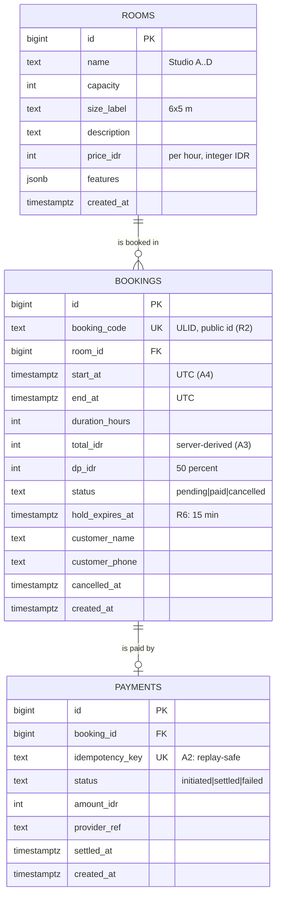
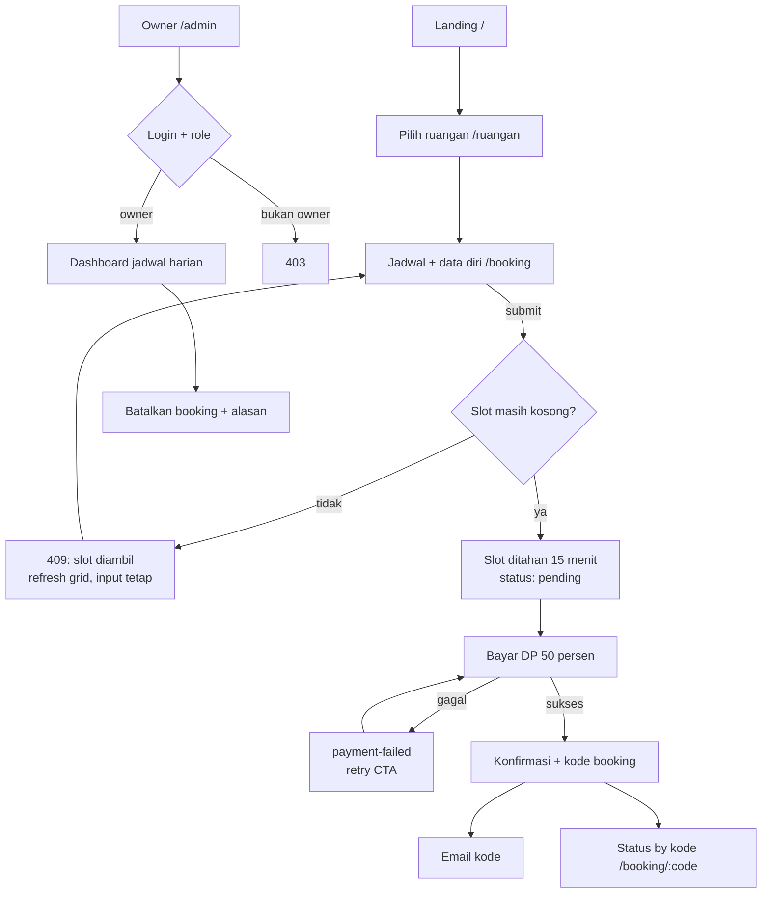
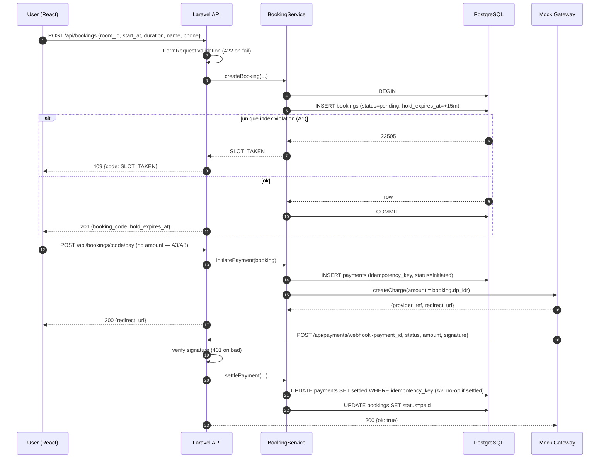
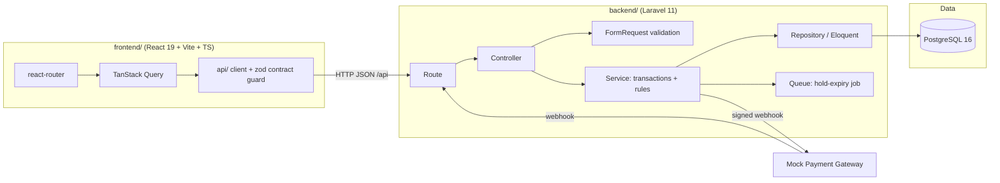
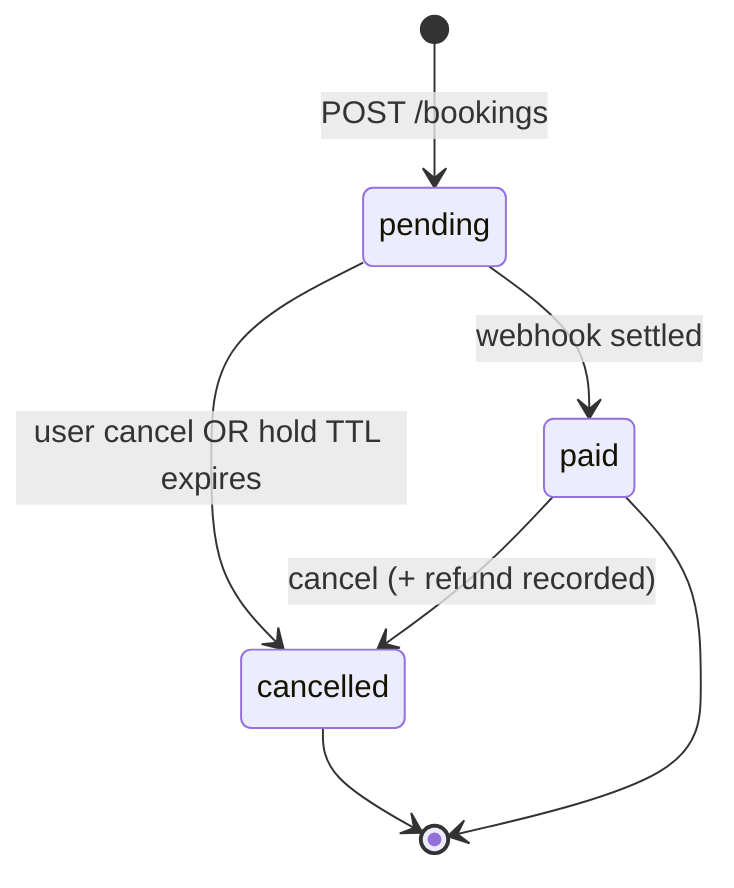

# P2.6 — Diagrams as Code (Mermaid)

Generated from the source of truth (schema / contract / layer map), not hand-drawn.
Same-commit rule applies: a schema or contract change moves the matching diagram.

## 1. ERD — from the migration (source: `backend/database/migrations`)



**The constraint that carries A1** (not expressible in Mermaid, stated here):

```sql
-- prevents double-booking the same room at the same instant
CREATE UNIQUE INDEX bookings_room_start_unique
  ON bookings (room_id, start_at)
  WHERE status <> 'cancelled';
```
A partial unique index so a **cancelled** booking does not block re-booking.

## 2. User flow — from the UX floor (P2.4)



## 3. Sequence — from the interface contract (P2.5): create booking + pay



## 4. Architecture / layer map — from P2.5



## 5. State machine — booking


